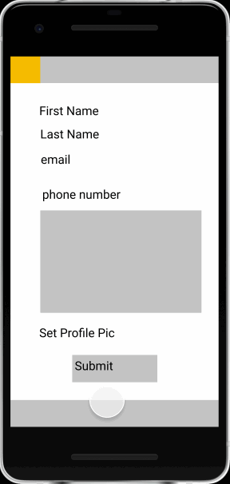

Original App Design Project - README Template
===

# TakeOff

## Table of Contents
1. [Overview](#Overview)
1. [Product Spec](#Product-Spec)
1. [Wireframes](#Wireframes)
2. [Schema](#Schema)

## Overview
### Description
Travel organization app with social integration. Allows users to sign in and add friends to create travel plan. Create itinerary, packing list, and list of places to visit along with potential rooms to stay.

### App Evaluation
[Evaluation of your app across the following attributes]
- **Category:** Travel + Social Networking
- **Mobile:** Mobile is essential for easy continuous updates of travel plans and allows multi user interaction. 
- **Story:** Encourages group traveling by allowing all members of the team/group to provide ideas. 
- **Market:** Anyone planning to travel can use the app, ideally 16+. Those in college wanting to go on spring break or in their twenties planning an annual vacation can use the app.
- **Habit:** Only applicable to traveling so habit of usage is proportional to the number of times one travels. The app can encourage small weekend trips as well.
- **Scope:** V1: basic itinerary(list of places and things to do) w/ image upload of destination + log in + share tool to add friends
V2: incorporate google flights/maps api to show location of destination and places to go in destination
V3: Add packing list
V4: List of place users plan to stay hotels/hostels/airbnb api

**Don't know if I want user to just include others users who have access or if I want to do followers?**
## Product Spec

### 1. User Stories (Required and Optional)

**Required Must-have Stories**

* user can login
* user can create an account
* user can add destination
* user can view map location of destination
* user can see view types and website of destination
* user can create checklist for planning
* user can see markers for destination, hotel, and visit places
* user can use a calender
* user can view options of places to stay
* user can create list of places to visit

**Optional Nice-to-have Stories**

* user can upload images to memories screen

### 2. Screen Archetypes
* Login Screen
    * user can create an account
    * user can add image as profile pic
    * user can login
* Add Destination Page
    * user can add a destination
    * user can view image of destination
    * user can swipe to delete destination
    * user can click on location to see map view
    * Optional: Scrolling Effects
* Destination Map Page
    * user can view a map location of the destination
    * user can see marker for their location and destination location
* Plan Page
    * user can use calendar to select dates
    * user can collapse calender once dates are selected
    * user can add to checklist of TODO items 
* Stay Page
    * user can view possible hotels options to stay
    * user can view image and info for hotels
* Visit/Itinerary Page
    * user can add list of museums/restaurants/locations to visit
    * user can display options in layout with Google Places SDK
    * user can remove an option with feature (long click or swipe to remove)
    * Optional: user can view list of recommended places to go at destination
* OPTIONAL: 
    * user can chat with followers/ travel buddies
    * Memories Page
        * user can upload an image onto feed w/ comment
        * user can like an image with double click
        * user can share image

### 3. Navigation

**Tab Navigation** (Tab to Screen)

* Plan Page
* Places to Stay Feed
* Places to Visit Feed

**Flow Navigation** (Screen to Screen)

* Login Screen
    => Home (Destination Page)
* Registration Screen
    => Home (Destination Page)
* Destination Page (Stream Screen)
    => Destination Map Page
* Destination Details Page (Stream Screen)
    => Plan Screen
    => Stay Screen
    => Visit Screen

## Wireframes
[Add picture of your hand sketched wireframes in this section]

### [BONUS] Digital Wireframes & Mockups

### [BONUS] Interactive Prototype

## Schema 
### Models
#### User
| Property | Type | Description |
| --- | --- | --- |
| objectId | String | unique id for the user post (default field) |
| author | Pointer to User | image author |
|image | File | image that user profile picture |

#### Destinations
| Property | Type | Description |
| --- | --- | --- |
| name | String | name of place that you search/add |
|image | File | image from Google Places API that displays destination |
| location | Parse GeoPoint | longitude and latitude of destination searched/added |
| address| String | address of location |
| types | String Array | array of destination types |
|websiteURI | String | website for destination |

#### Hotels
| Property | Type | Description |
| --- | --- | --- |
| name | String | name of hotel |
| address | String | address of the hotel|
| website | String | website of hotel |
| phoneNumber | String | hotel's phone number |
| location | Parse Geopoint | location of the hotel |
|imageURL | String | image url of hotel |
| priceLevel | long | price of hotel room |
| rating | double | rating of hotel |
| placeId | String | placeId for Google Place network request call to get hotel details |
| destination | Pointer | Pointer to destination associated with hotel |

#### VisitPlace
| Property | Type | Description |
| --- | --- | --- |
| name | String | name of restaurant, museum, tourist attraction |
| image | File | image of visit place |
|description | String | description of visit place |

### Networking
- [Add list of network requests by screen ]
- [Create basic snippets for each Parse network request]
- [OPTIONAL: List endpoints if using existing API such as Yelp]
